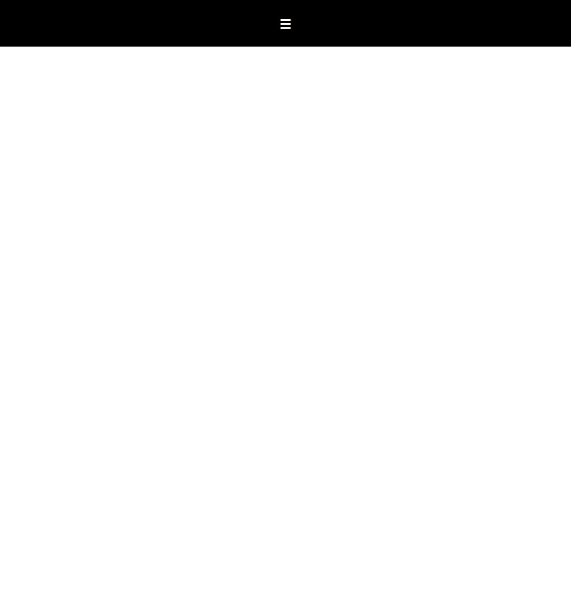
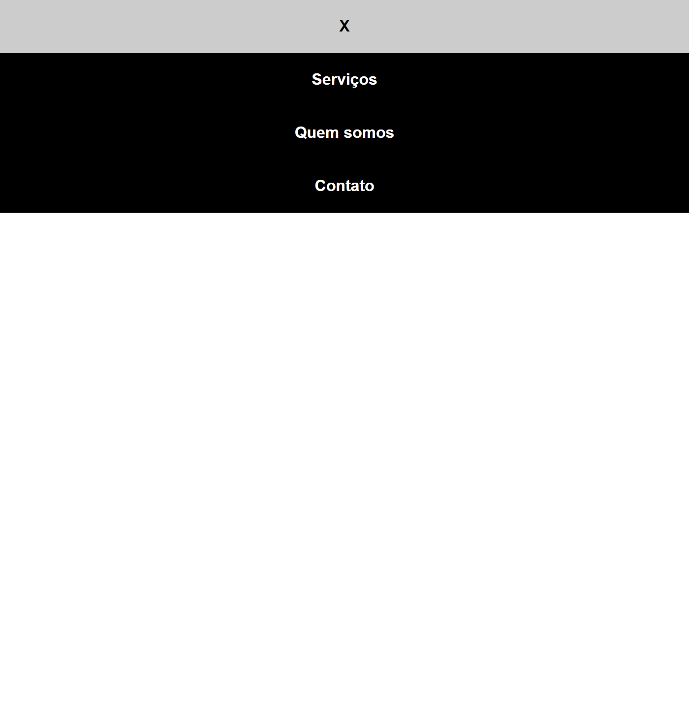
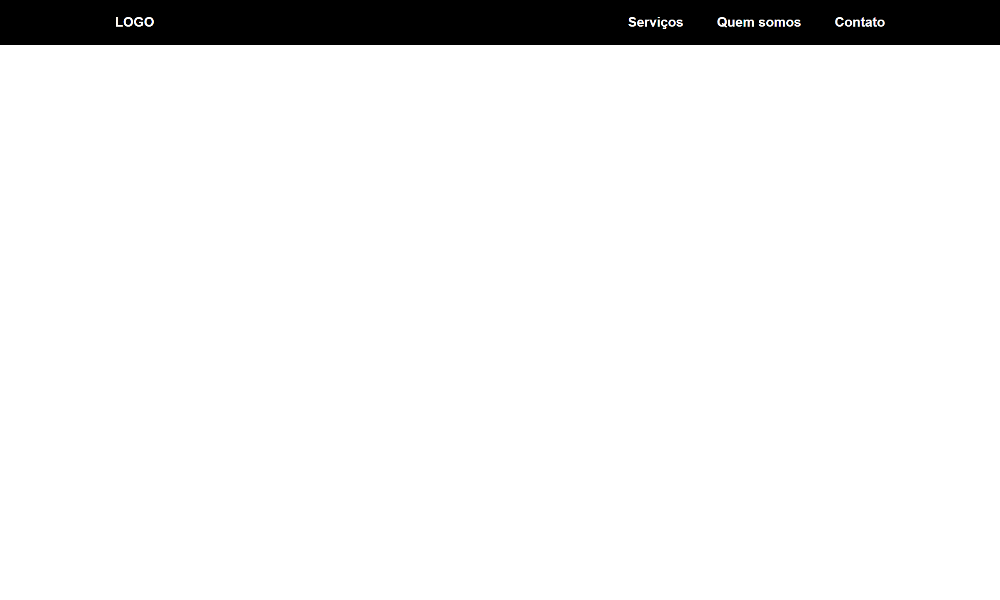

# Menu horizontal simples

Olá, seja muito bem vindo(a)!

## Descrição:

Este menu faz parte dos exercicios praticos de meus estudos. Ele é responsivo, projetado inicialmente para dispositivos móveis e com responsividade para desktops saindo de um menu vertical para horizontal. Usando javascript foi feita interação de abrir e fechar menu.

## Capturas de tela

Dispositivo móvel

Dispositivo desktop

